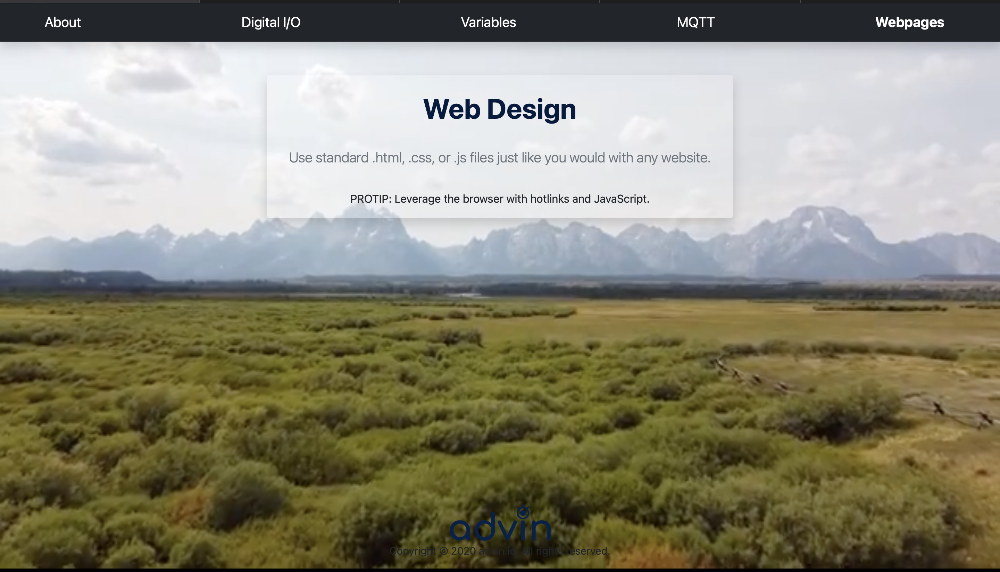

# uServer

Template for rapid IoT development on ESP32. Build webpages fast and exchange data quickly! Check out this project's Github Page <a href="https://jimothyjohn.github.io/uServer/">here</a> for a live demo.

## Features

See [`Features`](FEATURES.md) for full list of features and examples.

## Hardware Required

* This project is only tested on an <a href="https://www.mouser.com/ProductDetail/Espressif-Systems/ESP32-DevKitC-32UE/?qs=GedFDFLaBXFguOYDKoZ3jA%3D%3D">ESP32</a> (China)

## Software Required

* <a href="https://github.com/platformio/platformio-core">PlatformIO</a>

## Installation

See [`Quickstart`](QUICKSTART.md) to quickly get up and running.

## To-do List

* Migrate to LittleFS (SPIFFS deprecated)
* Add additional security/authentication
* Minimize energy consumption
* Port to other platforms
* <a href="https://randomnerdtutorials.com/esp32-microsd-card-arduino">Integrate persistent storage</a>
* Streamline JSON parsing on WebServer
